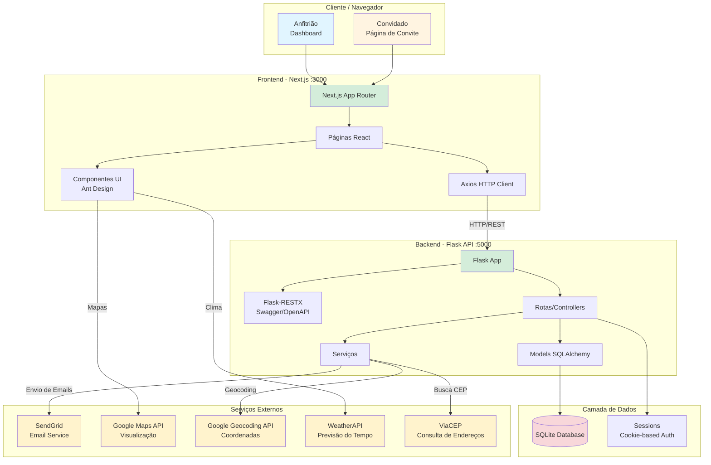

# Arquitetura do Sistema Venha

## Visão Geral

O sistema Venha é uma aplicação web completa para gerenciamento de convites e confirmações de presença (RSVP), construída com arquitetura de três camadas:

1. **Frontend (Apresentação)** - Interface web em Next.js/React
2. **Backend (Lógica de Negócio)** - API REST em Flask/Python
3. **Dados** - Banco de dados SQLite com integração a APIs externas

## Diagrama de Arquitetura



## Fluxo de Dados Principal

### 1. Criação de Evento (Anfitrião)
```
Anfitrião → Frontend (Dashboard) → POST /api/events/create → Backend
    ↓
Backend valida dados → Busca endereço (ViaCEP) → Geocoding (Google)
    ↓
Salva no SQLite → Retorna evento com slug único → Frontend exibe link
```

### 2. Confirmação de Presença (Convidado)
```
Convidado acessa /invite/{slug} → Frontend carrega dados do evento
    ↓
Frontend busca clima (WeatherAPI) e exibe mapa (Google Maps)
    ↓
Convidado preenche RSVP → POST /api/attendees/rsvp → Backend
    ↓
Backend valida → Salva no banco → Envia email (SendGrid) → Anfitrião notificado
```

### 3. Gerenciamento de Convidados
```
Anfitrião → Dashboard → GET /api/events/{id}/attendees → Backend
    ↓
Backend retorna lista → Frontend exibe tabela com estatísticas
    ↓
Anfitrião pode exportar CSV, editar ou remover convidados
```

## Componentes Principais

### Frontend (Next.js 16)

**Páginas:**
- `/` - Landing page
- `/signup` - Cadastro de anfitrião
- `/login` - Autenticação
- `/dashboard` - Painel do anfitrião
- `/eventos/novo` - Criação de evento
- `/eventos/[id]` - Detalhes e gerenciamento
- `/eventos/[id]/editar` - Edição de evento
- `/invite/[slug]` - Convite público (sem autenticação)
- `/rsvp/[slug]` - Gerenciar RSVP do convidado

**Componentes Reutilizáveis:**
- `EventMap` - Integração Google Maps
- `WeatherWidget` - Previsão do tempo
- `Logo` - Branding
- `LoadingSkeleton` - Estados de carregamento

**Bibliotecas:**
- `axios` - Cliente HTTP
- `ant-design` - Componentes UI
- `dayjs` - Manipulação de datas
- `@react-google-maps/api` - Mapas

### Backend (Flask + SQLAlchemy)

**Rotas Principais:**
- `auth.py` - Autenticação (signup, login, logout)
- `events.py` - CRUD de eventos
- `attendees.py` - Gerenciamento de RSVPs

**Models:**
- `Host` - Anfitriões (usuários)
- `Event` - Eventos criados
- `Attendee` - Confirmações de presença

**Serviços:**
- `email_service.py` - SendGrid (notificações)
- `geocoding_service.py` - Google Geocoding API
- `cep_service.py` - ViaCEP (endereços brasileiros)

**Segurança:**
- Autenticação via sessão (cookie-based)
- Bcrypt para hash de senhas
- Rate limiting (Flask-Limiter)
- Validação de entrada
- CORS configurado

### Banco de Dados (SQLite)

**Tabelas:**

```sql
hosts
  - id (PK)
  - email (unique)
  - whatsapp_number
  - name
  - password_hash
  - created_at

events
  - id (PK)
  - host_id (FK → hosts)
  - slug (unique, 8 chars)
  - title
  - description
  - event_date
  - start_time
  - end_time
  - address_full
  - latitude, longitude
  - allow_modifications
  - allow_cancellations
  - created_at

attendees
  - id (PK)
  - event_id (FK → events)
  - whatsapp_number
  - name
  - family_member_names (JSON)
  - num_adults
  - num_children
  - comments
  - status (confirmed/cancelled)
  - rsvp_date
  - last_modified

  UNIQUE(event_id, whatsapp_number)
```

## Integrações Externas

### 1. SendGrid (Emails)
- **Uso:** Notificações ao anfitrião quando há RSVP/modificação/cancelamento
- **Modo Simulação:** Por padrão, imprime emails no console
- **Modo Produção:** Requer SENDGRID_API_KEY

### 2. Google Maps API (Visualização de Mapas)
- **Uso:** Frontend exibe mapa na página do convite
- **Configuração:** NEXT_PUBLIC_GOOGLE_MAPS_API_KEY
- **Comportamento Gracioso:** Se não configurado, não exibe mapa

### 3. Google Geocoding API (Coordenadas)
- **Uso:** Backend converte endereço completo em lat/long
- **Fallback:** Usa Nominatim (OpenStreetMap) se Google falhar
- **Configuração:** GOOGLE_GEOCODING_API_KEY

### 4. WeatherAPI (Previsão do Tempo)
- **Uso:** Frontend exibe clima previsto na página do convite
- **Limitação:** Apenas até 3 dias no futuro (plano gratuito)
- **Configuração:** NEXT_PUBLIC_WEATHER_API_KEY

### 5. ViaCEP (Endereços)
- **Uso:** Backend busca endereço completo a partir do CEP
- **API Pública:** Sem necessidade de chave
- **Limitação:** Apenas CEPs brasileiros

## Decisões de Arquitetura

### Por que Next.js?
- **SSR e SSG:** Melhora SEO e performance
- **App Router:** Estrutura moderna baseada em diretórios
- **Turbopack:** Build e HMR extremamente rápidos
- **React Server Components:** Reduz JavaScript no cliente

### Por que Flask?
- **Simplicidade:** API REST rápida e direta
- **Flask-RESTX:** Documentação Swagger automática
- **SQLAlchemy:** ORM poderoso e flexível
- **Ecossistema Python:** Integração fácil com bibliotecas

### Por que SQLite?
- **Desenvolvimento:** Zero configuração
- **Portabilidade:** Arquivo único, fácil de versionar
- **Produção:** Deve ser substituído por PostgreSQL

### Comunicação Frontend-Backend
- **Protocolo:** HTTP/REST com JSON
- **Autenticação:** Session cookies (httpOnly, secure)
- **CORS:** Configurado para permitir localhost:3000
- **API Versionada:** `/api/*` como prefixo

## Segurança

### Autenticação
- **Método:** Cookie-based sessions
- **Biblioteca:** Flask sessions com SECRET_KEY
- **Proteção:** httpOnly, secure, SameSite

### Senhas
- **Hash:** Bcrypt com salt automático
- **Armazenamento:** Apenas hash no banco
- **Validação:** Força mínima não implementada (melhoria futura)

### Rate Limiting
- **Endpoints Protegidos:**
  - `/api/attendees/rsvp` - 30 req/min
  - `/api/auth/login` - 5 req/min
  - `/api/auth/signup` - 5 req/min

### Validação
- **Input:** Validação em todos os endpoints
- **WhatsApp:** Formato brasileiro validado
- **CEP:** Formato validado antes de buscar
- **Emails:** Validação de formato

## Escalabilidade

### Limitações Atuais
- SQLite não suporta alta concorrência
- Rate limiting em memória (perde ao reiniciar)
- Sessions em memória (não funciona com múltiplas instâncias)

### Melhorias para Produção
1. **Banco de Dados:** Migrar para PostgreSQL
2. **Cache:** Redis para sessions e rate limiting
3. **Storage:** S3 para arquivos (se implementar uploads)
4. **CDN:** CloudFront para assets estáticos
5. **Load Balancer:** Múltiplas instâncias da API

## Deployment

### Desenvolvimento (Docker Compose)
```
frontend (Node 20) :3000
backend (Python 3.11) :5000
SQLite (arquivo local)
```

### Produção (Recomendado)
```
Frontend → Vercel/Netlify (Next.js deployment)
Backend → Fly.io/Railway/Heroku (Flask deployment)
Database → PostgreSQL managed (Railway/Supabase)
```

## Próximos Passos

1. **Testes Automatizados:** Jest (frontend) + Pytest (backend)
2. **CI/CD:** GitHub Actions para deploy automático
3. **Monitoramento:** Sentry para error tracking
4. **Analytics:** Google Analytics ou Plausible
5. **Multi-idioma:** i18n para internacionalização
