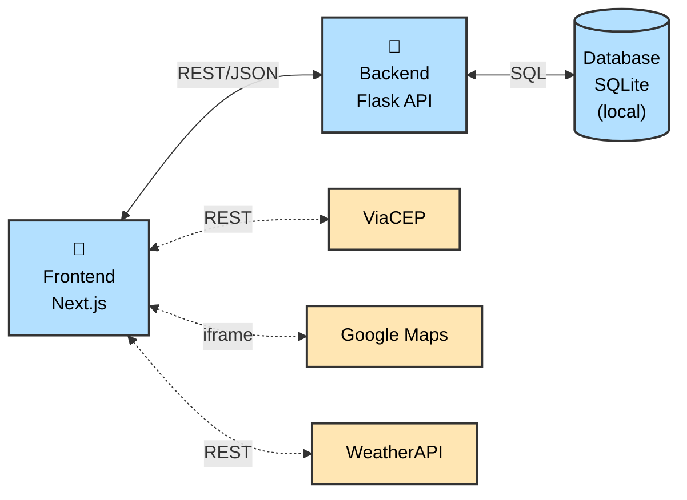

# Venha v2 - Frontend (Next.js)

Interface web para o sistema de convites online Venha, permitindo que anfitriões gerenciem eventos e convidados confirmem presença.

> **Nota:** Esta é a versão 2 (v2) do Venha, com arquitetura simplificada. A versão original está disponível em [rsvp_app_front_end](https://github.com/FernandaFranco/rsvp_app_front_end).

## 📋 Sobre o Projeto

O sistema Venha permite que anfitriões criem eventos e gerem um link de convite para compartilhar, e assim gerenciar confirmações de presença. Os convidados podem confirmar presença, modificar ou cancelar suas respostas através desse link.

### Funcionalidades Principais

**Para Anfitriões:**

- Cadastro e autenticação de usuário
- Criação de eventos com data, hora e endereço (via CEP)
- Visualização de lista de eventos criados
- Gerenciamento de convidados confirmados
- Recebimento de emails simulados quando alguém confirma presença
- Exportação de lista de convidados em CSV
- Configuração de permissões (permitir/bloquear modificações e cancelamentos)

**Para Convidados:**

- Visualização de detalhes do evento via link
- Confirmação de presença (RSVP)
- Informação de número de adultos e crianças
- Comentários sobre necessidades especiais ou alergias
- Modificação de confirmação de presença
- Cancelamento de presença com motivo opcional

## 🏗️ Arquitetura da Aplicação

<details>
<summary>💡 Ver diagrama de arquitetura (clique para expandir)</summary>



</details>

**Legenda:**

- **Linha contínua (←→):** Comunicação obrigatória
- **Linha tracejada (←-→):** Comunicação opcional
- **🐳 (Docker):** Container Docker separado
- **Azul:** Módulos implementados no projeto
- **Amarelo:** APIs externas

**Componentes:**

- **Frontend (Next.js) 🐳:** Interface web responsiva, páginas públicas e privadas, autenticação via session cookies
- **Backend (Flask) 🐳:** API REST com lógica de negócio, validações, documentação Swagger automática
- **Database (SQLite):** Arquivo local montado via volume Docker para persistência de dados (hosts, eventos e RSVPs)
- **APIs Externas:** ViaCEP (endereços), Google Maps (mapas via iframe), WeatherAPI (clima)
- **Notificações:** Emails simulados no console (sem envio real)

## 🌐 APIs Externas

O frontend integra-se com as seguintes APIs externas:

### 1. Google Maps (iframe embed)

**Propósito:** Exibição de mapas nas páginas de convite e criação de evento.

**Licença/Custo:**

- **Gratuito** - Usa iframe embed do Google Maps, não requer chave de API
- Funciona passando o endereço diretamente na URL

**Uso no Frontend:**

- Componente: `src/app/components/EventMap.js`
- Páginas:
  - `/invite/[slug]/page.js` (página pública do convite para convidados)
  - `/eventos/novo/page.js` (página de criação de evento para anfitriões)

**Como funciona:**

O mapa é renderizado via iframe usando a URL:
```
https://www.google.com/maps?q={endereço}&z=15&output=embed
```

### 2. WeatherAPI

**URL:** https://www.weatherapi.com/

**Propósito:** Exibição de previsão do tempo na página do convite.

**Licença/Custo:**

- Plano gratuito: 1.000.000 chamadas/mês
- Previsão até 3 dias no futuro (plano gratuito)
- Licença: Proprietária

**Uso no Frontend:**

- Página: `/invite/[slug]/page.js` (implementado diretamente na página do convite)
- Funcionalidade: Exibir temperatura, condição climática e ícone do tempo
- Limitação: Apenas eventos com data até 3 dias no futuro exibirão previsão

**Endpoints utilizados:**

- `GET https://api.weatherapi.com/v1/forecast.json`
  - Parâmetros: `key` (API key), `q` (cidade), `days`, `lang=pt`
  - Retorna: `forecast.forecastday[0].day` (temperatura, condição, ícone)

### 3. ViaCEP

**URL:** https://viacep.com.br/

**Propósito:** Busca automática de endereços brasileiros a partir do CEP.

**Licença/Custo:**

- API pública e completamente gratuita
- Sem necessidade de registro ou chave de API
- Licença: Livre (domínio público)

**Uso no Frontend:**

- Página: `/eventos/novo/page.js`
- Funcionalidade: Quando o anfitrião digita um CEP ao criar um evento, busca automaticamente o endereço (rua, bairro, cidade, estado) para preencher os campos do formulário
- Validação: CEP deve ter exatamente 8 dígitos

**Endpoints utilizados:**

- `GET https://viacep.com.br/ws/{cep}/json/`
  - Parâmetros: `cep` (8 dígitos, apenas números)
  - Retorna: `logradouro`, `bairro`, `localidade`, `uf`

## 🛠️ Tecnologias Utilizadas

- **Next.js 16** - Framework React com Turbopack
- **React 19** - Biblioteca de interface
- **Ant Design** - Biblioteca de componentes UI
- **Axios** - Cliente HTTP para requisições à API
- **Tailwind CSS** - Estilização

## 📁 Estrutura do Projeto

```
frontend/
├── src/
│   └── app/
│       ├── components/          # Componentes React reutilizáveis
│       │   ├── EventMap.js     # Mapa do Google (iframe embed)
│       │   ├── ErrorBoundary.js # Tratamento de erros
│       │   ├── LoadingSkeleton.js # Estados de carregamento
│       │   └── Logo.js         # Logo da aplicação
│       ├── auth/                # Página de autenticação (login/signup)
│       │   └── page.js
│       ├── dashboard/           # Dashboard do anfitrião
│       │   └── page.js
│       ├── eventos/             # Gerenciamento de eventos
│       │   ├── [id]/
│       │   │   ├── page.js     # Visualizar evento
│       │   │   └── editar/page.js # Editar evento
│       │   └── novo/page.js    # Criar novo evento
│       ├── invite/[slug]/       # Página pública do convite
│       │   └── page.js
│       ├── rsvp/[slug]/        # Gerenciamento de RSVP do convidado
│       │   └── page.js
│       ├── layout.js            # Layout principal
│       └── page.js              # Página inicial (redireciona para /dashboard ou /auth)
├── public/                      # Arquivos estáticos
├── docker-compose.yml           # Configuração Docker Compose
├── Dockerfile                   # Dockerfile do frontend
├── package.json                 # Dependências do projeto
├── package-lock.json            # Lock de versões das dependências
├── next.config.mjs              # Configuração do Next.js
├── postcss.config.mjs           # Configuração do PostCSS
├── jsconfig.json                # Configuração JavaScript
├── eslint.config.mjs            # Configuração do ESLint
├── .env.local.example           # Template de variáveis de ambiente
├── .gitignore                   # Arquivos ignorados pelo Git
└── README.md                    # Este arquivo
```

## 🚀 Como Rodar o Projeto (Docker)

Esta é a forma recomendada de rodar o projeto completo (frontend + backend). Este método garante que todas as dependências sejam instaladas corretamente e que ambos os serviços se comuniquem adequadamente.

### Pré-requisitos

- Docker Desktop instalado e rodando
- Git instalado
- Conexão com internet para download de dependências

### Passo 1: Clonar os Repositórios

Crie um diretório pai e clone ambos os projetos:

```bash
mkdir venha_project
cd venha_project
git clone https://github.com/FernandaFranco/venha-v2-backend.git backend
git clone https://github.com/FernandaFranco/venha-v2-frontend.git frontend
```

**Importante:** Os comandos acima clonam os repositórios nas pastas `backend` e `frontend` respectivamente, que são os nomes esperados pelo Docker Compose.

**Estrutura de diretórios esperada:**

```
venha_project/
├── backend/    (repositório do backend)
│   ├── app.py
│   ├── .env.example
│   ├── Dockerfile
│   └── ...
└── frontend/   (este repositório)
    ├── docker-compose.yml
    ├── .env.local.example
    ├── Dockerfile
    └── ...
```

### Passo 2: Configurar Backend (.env)

Primeiro, configure o backend:

1. Navegue até a pasta do backend e copie o arquivo de exemplo:

```bash
cd backend
cp .env.example .env
```

2. Edite o arquivo `backend/.env`:

```bash
# Obrigatórias
FLASK_APP=app.py
FLASK_ENV=development
SECRET_KEY=sua-chave-secreta-aqui    # Gere com: python3 -c "import secrets; print(secrets.token_hex(32))"
DATABASE_URL=sqlite:///invitations.db

# Frontend URL
FRONTEND_URL=http://localhost:3000
```

### Passo 3: Configurar Frontend (.env.local)

Agora configure o frontend:

1. Navegue até a pasta do frontend e copie o arquivo de exemplo:

```bash
cd ../frontend
cp .env.local.example .env.local
```

2. Edite o arquivo `frontend/.env.local`:

```bash
NEXT_PUBLIC_API_URL=http://localhost:5000
NEXT_PUBLIC_WEATHER_API_KEY=sua-chave-weatherapi-aqui
```

**APIs Necessárias:**

- **NEXT_PUBLIC_API_URL:** URL do backend (use `http://localhost:5000`)
- **NEXT_PUBLIC_WEATHER_API_KEY:** Chave do WeatherAPI.com (necessária para previsão do tempo)

**Como obter a chave WeatherAPI:**

1. Acesse [WeatherAPI.com](https://www.weatherapi.com/)
2. Crie uma conta gratuita (1 milhão de chamadas/mês grátis)
3. Vá em "My Account" → "API Keys"
4. Copie a chave gerada

### Passo 4: Rodar com Docker Compose

**IMPORTANTE:** O `docker-compose.yml` está localizado na pasta `frontend/`. Certifique-se de estar na pasta `frontend/`:

```bash
cd ../frontend  # Se ainda não estiver na pasta frontend
docker-compose up --build
```

**O que acontece:**

- O Docker baixa as imagens base necessárias
- Instala todas as dependências do backend (Python/Flask)
- Instala todas as dependências do frontend (Next.js)
- Inicia ambos os serviços
- Backend fica disponível na porta 5000
- Frontend fica disponível na porta 3000

**Primeira execução:** Pode levar alguns minutos para baixar as imagens e instalar tudo.

### Passo 5: Acessar a Aplicação

Aguarde até ver as mensagens indicando que os serviços estão prontos. Então acesse:

- **Frontend (Interface):** http://localhost:3000
- **Backend API:** http://localhost:5000 (redireciona automaticamente para a documentação Swagger)
- **Documentação Swagger:** http://localhost:5000/api/docs

## 🐛 Solução de Problemas

### Erro: Porta já em uso (3000)

```bash
# Mac/Linux
lsof -ti:3000 | xargs kill -9
```

### Containers não iniciam ou erro de dependências

```bash
docker-compose down -v
docker-compose up --build --force-recreate
```

### Frontend não consegue conectar ao backend (Network Error)

- Verifique se `NEXT_PUBLIC_API_URL=http://localhost:5000` em `frontend/.env.local`
- Verifique se `FRONTEND_URL=http://localhost:3000` em `backend/.env`
- Certifique-se de que ambos os containers estão rodando: `docker ps`

### Previsão do tempo não aparece

1. Verifique se `NEXT_PUBLIC_WEATHER_API_KEY` está configurado em `.env.local`
2. Certifique-se de que o evento tem data até 3 dias no futuro (limitação do plano gratuito)

## 📄 Licença

Este projeto foi desenvolvido para fins educacionais.

## 👤 Autora

Fernanda Franco

PUC-Rio - Pós-Graduação em Engenharia de Software
